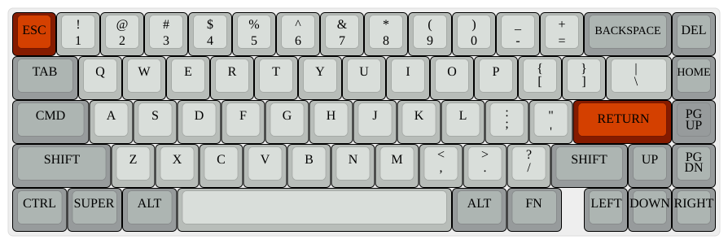
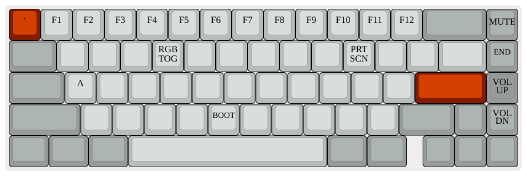
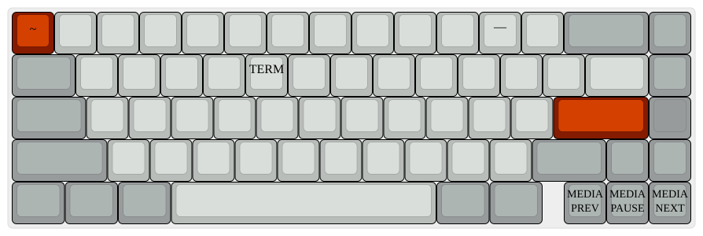

# QMK Keymaps

Keymaps for keyboards using [QMK Firmware](https://github.com/qmk/qmk_firmware)

## Massdrop Alt

### Layer 0

| KEY         | NOTES   |
| ----------- | ------- |
| FN          | Layer 1 |
| CMD         | Layer 2 |
| LEFT SHIFT  | `(` tap |
| RIGHT SHIFT | `)` tap |

### Layer 1

| KEY     | NOTES                                 |
| ------- | ------------------------------------- |
| RGB TOG | Toggle RGB on/off                     |
| BOOT    | Put into bootloader mode for flashing |

### Layer 2

| KEY     | NOTES                                |
| ------- | ------------------------------------ |
| TERM    | CTRL+ALT+T (Open Terminal)           |
| PRT SCN | ALT+PSCR (Screenshot Focused Window) |

### Emoji

> https://gitlab.gnome.org/GNOME/librsvg/-/issues/911

| KEY | Emoji |
| --- | ----- |
| U   | 🐧    |
| S   | 🐍    |

### RGB

`RGB TOG` can be used with modifier keys for additional effects

| KEY   | EFFECT  |
| ----- | ------- |
| SHIFT | Red     |
| CTRL  | Rainbow |
| ALT   | White   |
